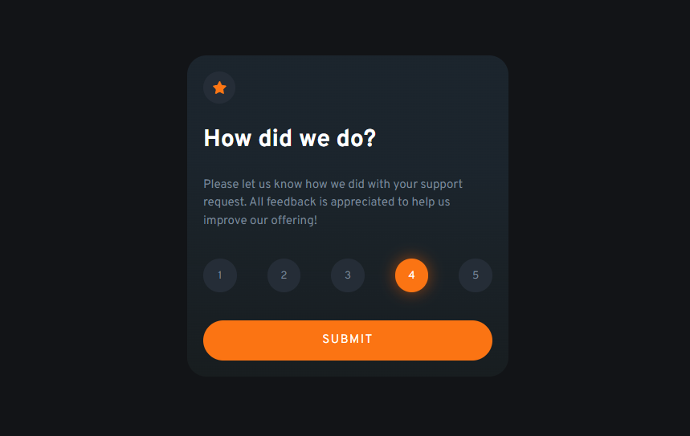

# Frontend Mentor - Interactive rating component solution

This is a solution to the [Interactive rating component challenge on Frontend Mentor](https://www.frontendmentor.io/challenges/interactive-rating-component-koxpeBUmI). Frontend Mentor challenges help you improve your coding skills by building realistic projects. 

## Overview

### The challenge

Users should be able to:

- View the optimal layout for the app depending on their device's screen size
- See hover states for all interactive elements on the page
- Select and submit a number rating
- See the "Thank you" card state after submitting a rating

### Screenshot

### Links

- Solution URL: [Add solution URL here](https://your-solution-url.com)
- Live Site URL: [https://mv805.github.io/interactive-rating-component-react/](https://mv805.github.io/interactive-rating-component-react/)

## My process

### Built with

- Flexbox
- CSS modules
- Mobile-first workflow
- [React](https://reactjs.org/) - JS library

### What I learned

I enjoyed this challenge and was able to further solidify my React skills as the primary goal.

## Author

- Frontend Mentor - [@mv805](https://www.frontendmentor.io/profile/mv805)
